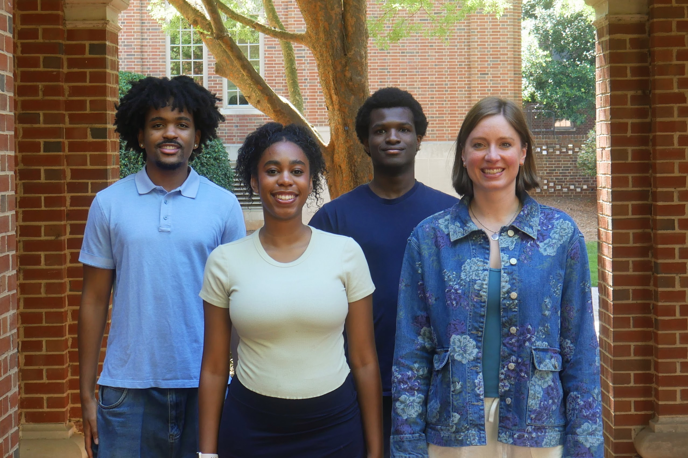
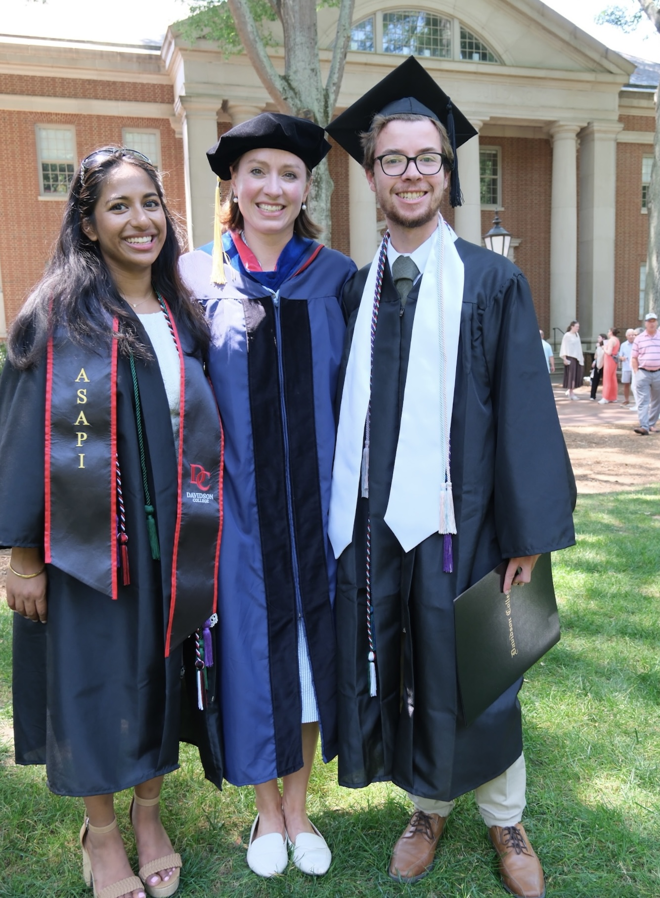
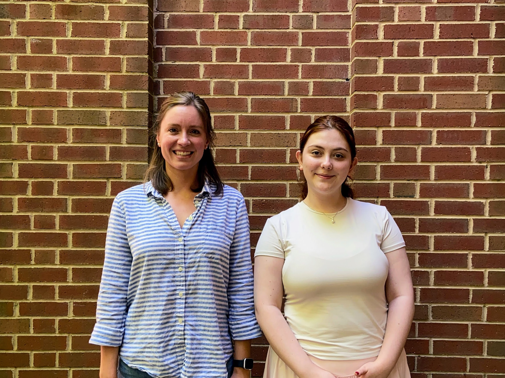
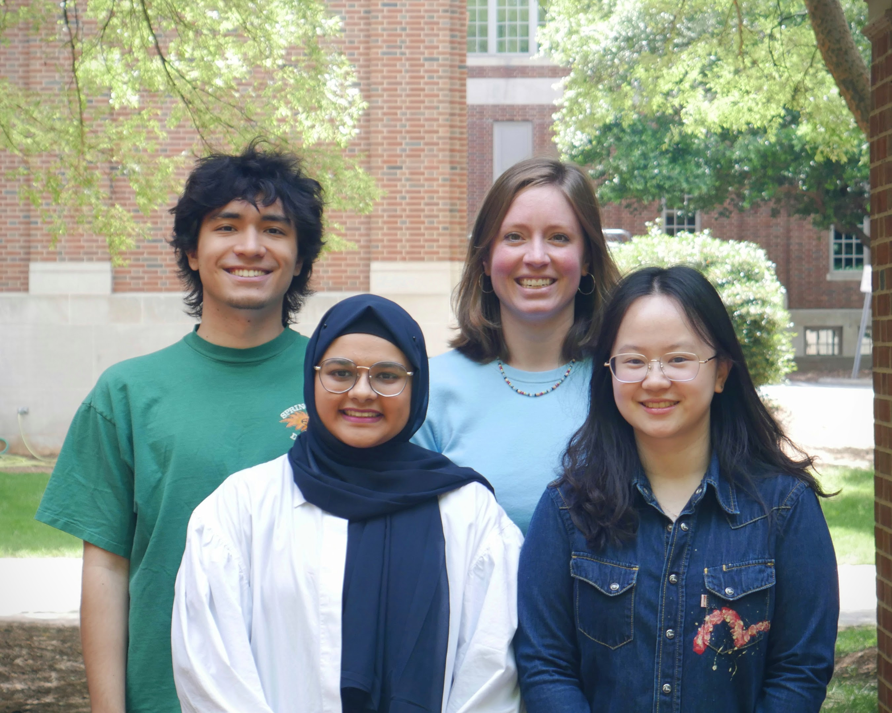

---
# Feel free to add content and custom Front Matter to this file.
# To modify the layout, see https://jekyllrb.com/docs/themes/#overriding-theme-defaults

layout: default
permalink: /
---

Our data visualization research can cover many areas, like visual perception, 
using generative AI to create visualizations, or deliberately designing for serendipity.
Underpinning all of our work is an emphasis on the human experience and inclusive
practices. 

The lab is located in Watson 232. 

*Data Vis Lab members: Christian Weaver, Olivia Burls, Kwasi Buansi, Dr. Katy Williams*

# Former Lab Members
## Academic year 2025-2026

*Data Vis Lab members: Ellora Devulapally, Dr. Katy Williams, Taft Harrell*

## 2025

*Data Vis Lab members: Dr. Katy Williams and Yurda Yolcu*

## 2024

*Data Vis Lab members: David Yoder, Dr. Williams, Yumna Ahmed, Katherine Hu*
