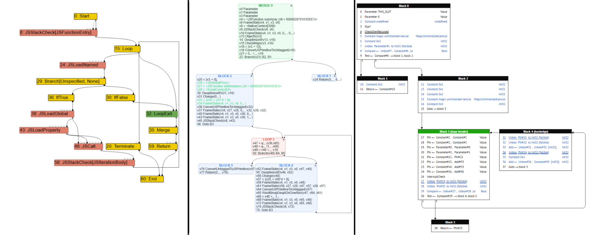
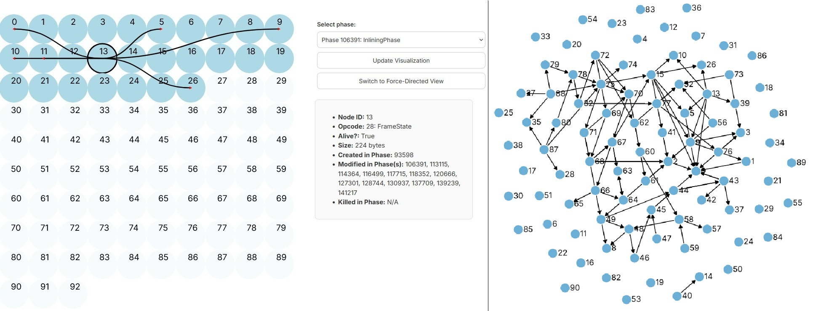
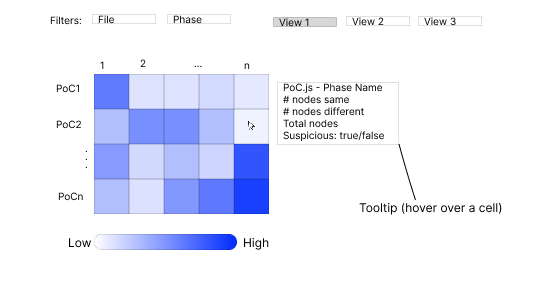
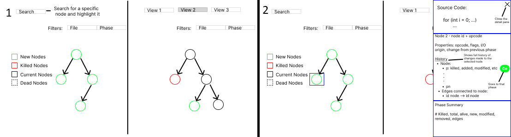
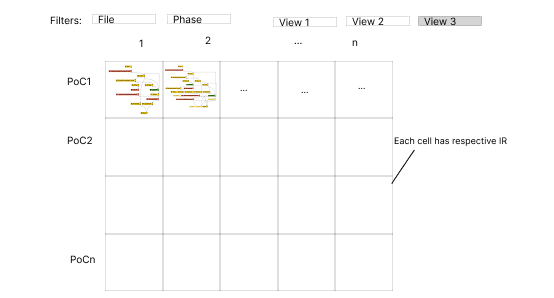
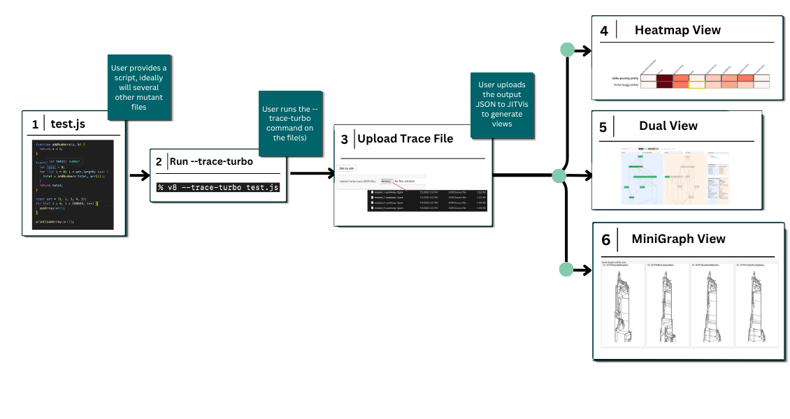
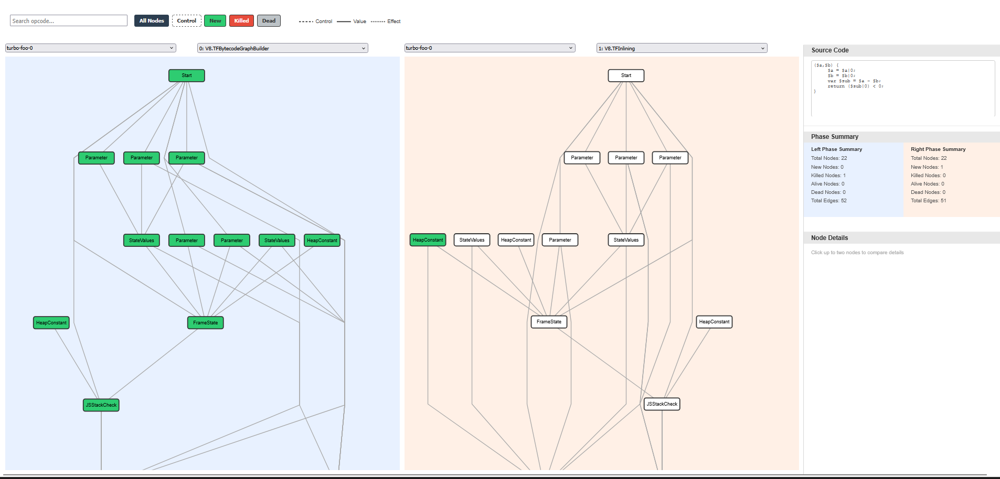
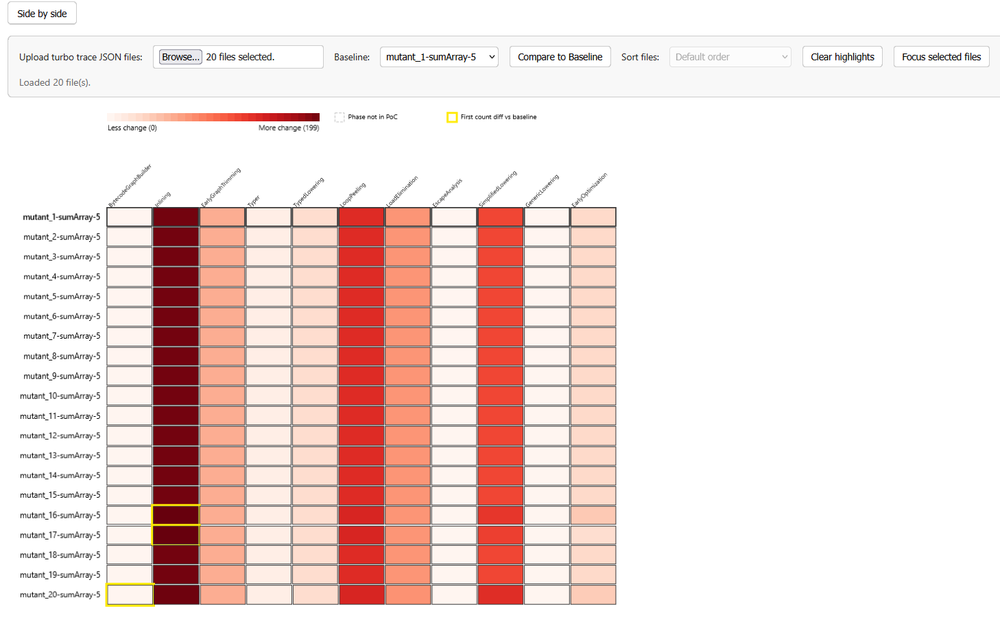
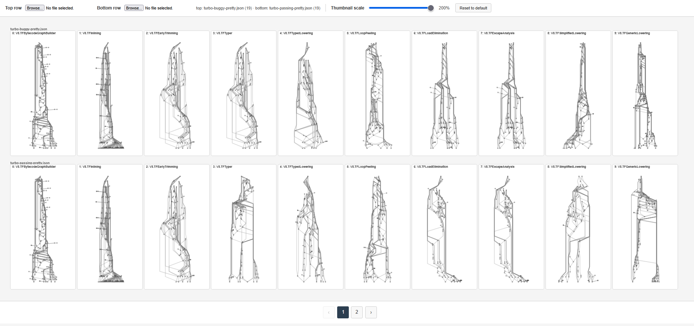

#### by [Kwasi Buansi](/people#kwasi-buansi)

Before I joined this project, Taft Harrell and Ellora Devulapally, two Davidson College graduates, had already taken the first steps toward visualizing compiler intermediate representations. Their prototype was initially a static grid of numbered nodes and edges, to help make sense of the data, and then they refined their prototype into a force-directed graph layout, intended to automatically organize the graph data. However, as graphs grew denser, the force-directed view collapsed into unreadable “hairballs,” and it was clear we needed a different approach to display the graphs as they changed across phases. Initially, my job was to analyze what Taft and Ellora had already developed, along with the literature behind graph visualization, with the goal of creating something more readable. 

Eventually, Dr. Williams (my mentor), Olivia Burls (my partner), and I began developing [JITVis](https://github.com/Davidson-Data-Vis-Lab/summer-JIT-vis): a visualization tool for debugging Google Chrome’s V8 Just-In-Time (JIT) compiler. Over the summer, our team studied V8’s optimization pipeline, reviewed visualization research, and interviewed compiler experts at V8 about how they debug the V8 compiler. We also examined tools like [Turbolizer](https://v8.github.io/tools/head/turbolizer/index.html) and [iongraph](https://spidermonkey.dev/blog/2025/10/28/iongraph-web.html), two tools that visualize changes made to code by a compiler. The result is JITVis - a tool combining a heatmap for comparing many mutated traces across optimization phases, a dual view for detailed IR analysis of two phases, and a minigraph for scanning IR structure of many phases. Built with D3.js and informed by expert feedback, JITVis aims to help debuggers find where the compiler's behavior diverges from expectations, without needing to scan thousands of nodes across multiple graphs.

Compilers are software that translate human readable code (i.e. languages like C/C++ or Rust) into lower level machine code. Compilers simultaneously make optimizations to code during the translation, decreasing the runtime of code by leaps and bounds. These optimizations are crucial for websites and search engines, which demand fast startup and runtimes. In fact, speed is so crucial that web browsers, like Google Chrome and Firefox, use a special class of compiler, known as a Just-In-Time (JIT) compiler. JIT compilers have faster startup times compared to regular Ahead-of-Time compilers, and make optimizations during the code’s runtime. However, the changes JIT compilers make during optimization phases are difficult to track, so bugs tend to be more difficult to find.

This is where our work comes in. As newcomers to compiler development, we studied Google V8’s entire compilation pipeline, learning how exactly input code is optimized while studying pre-existing debugging strategies used by experts. We analyzed data visualization literature and used our findings to develop JITVis. We interviewed a V8 compiler expert on their entire workflow, including techniques they employ when using Turbolizer, outside tools used to generate test cases, and any other knowledge we can use to improve their workflow. We hope JITVis reduces tab-switching and manual cross-file comparisons for compiler experts, while addressing other weaknesses in preexisting alternatives.

### Background

JIT compilers process human-readable code into machine code in distinct **phases**. These phases each contain **Intermediate Representations (IRs)**. IRs are essentially a transitory state used by the compiler to transform the source code into optimized machine code. IRs are represented as graphs, such as **Sea-of-Nodes (SoN)** or **Control Flow (CFG)** graphs. Google developers currently visualize these changes by using V8’s `--trace-turbo` command on JavaScript files to produce a .JSON trace file to be uploaded to Turbolizer. Iongraph is an alternative that only supports the CFG layout. Both show each IR phase’s respective graph, and Turbolizer specifically has the added benefit of source-code-to-node linkage.

*From left to right: a SoN graph in Turbolizer, a CFG in Turbolizer, and a CFG visualized in iongraph. iongraph only supports the CFG format.*

However, there are a few key flaws with both tools:

- Even though Turbolizer and iongraph save users the trouble of reading thousands of lines of text outputs, they require debuggers to parse several phases, looking for specific nodes and edges that may cause bugs.
- In data visualization, giving users multiple different ways to view the same data often helps in generating insight, hence data abstraction is useful. However, Turbolizer and iongraph only provide users with each phase’s raw IR data.
- Compiler debuggers will often mutate code to simulate and pinpoint specific compiler bugs. When using several mutations, the debugger will now have to compare data across phases and files. Neither tool supports multiple file inputs–a user would have to upload each mutation in a separate Turbolizer or iongraph instance.
- Debuggers will often switch between viewing the raw JSON text dump and the compiler graphs, which can be tedious. Neither tool centralizes context switching.
- A V8 compiler expert we interviewed emphasized that Turbolizer can be annoying to use due to long load times when uploading larger graphs due to poor optimization.

Based on conversations with Dr. Lim, a compiler expert at Davidson, we created two overviews for JITVis that allow debuggers to quickly locate potentially problematic compiler phases, and an additional detail view containing a maximum of two IR graphs of the user’s choosing for lower level, phase-by-phase analysis.

### Initial Steps

To start, I needed to catch up on what had already been done thus far. Taft and Ellora had already created a force-directed layout, based on a trace file format alternative to Google V8’s. 

*Taft and Ellora’s first prototypes. To the left is the static view, which was used in initial stages for making sense of the data. This view displays nodes as numbered circles and their dependencies as edges, similar to Turbolizer but in an unchanging grid. A tooltip to the right of the grid provides details on the selected node. To the right is the force-directed view, which uses force-directed drawing to display nodes and edges.*

The force-directed layout fell victim to the hairball effect -- the volume and density of the nodes and edges caused the diagram to look unreadable in certain phases. As such, we decided to abandon the first prototype in favor of something more usable. We conducted a short literature review to find the most ideal graph layouts. My area of focus was on representing changes over time, which in our case meant changes made to IRs across phases. My findings included:

- There are two main schools of thought when it comes to representing change over time–representation through animation, and representation through small multiples. Small multiples refers to representing changes made over time side-by-side, frame-by-frame. Small multiples tend to be more beneficial for data analysis than animation.
- Interactivity was consistently found to improve insight-finding.
- Many tools included multiple different data representations.

My findings were consistent with Olivia’s, making us confident enough to draft a mockup visualization.

*Heatmap mockup. In the grid, rows represent file names, and columns represent phase numbers. Each cell is encoded using a metric of suspiciousness (i.e., how likely it is that that specific phase in its corresponding file is buggy). A tooltip appears when hovering over a cell containing the indicated fields. The user can filter by a specific file and/or phase using the topmost “filters” dropdowns.*

*Dual-view mockup. On the left side (1), there are two user-inputted IR graphs. The legend to the left side of the leftmost graph indicates what colors represent which type of node. Above the graph is the same filtering option as in the heatmap view. Above that is a search bar that allows users to search for a specific node to highlight. The right side (2) shows the side panel that appears on the right side when clicking a node. In the side bar, you can see which line of code corresponds to that specific node, and an entire history of that nodes activity throughout all IR phases. Clicking on the green “GO” button automatically navigates to the corresponding phase. Below the node history section, you can see all nodes that link to the selected node in the current phase, and an overall summary of the phase for the selected node.*

*Minigraph mockup. This view contains the same filtering and grid layout as the heatmap view. Instead of a suspiciousness score, each cell is contains its own graph that is a miniaturized graph of the corresponding cell’s IR (i.e., the minigraph in the cell located at (PoC1, 1) is the first phase of PoC1’s graph).*

After designing our mockups, we presented them to Dr. Lim, who liked our idea of an easier way to compare two IR graphs, and our overviews which can be used to more easily find suspicious files for further analysis. After receiving the green light from Dr. Williams, we began developing our prototype visualization.

### JITVis Walkthrough

We present JITVis–a tool designed to streamline the JIT compiler debugging process, providing several helpful views in one centralized program.

*JITVis user flow. (1) The user starts with a JavaScript file. They may run a fuzzing algorithm to produce mutated files to be uploaded into JITVis. (2) The user runs the `--trace-turbo` command to output JSON trace files. (3) The user uploads the JSON traces into the program to produce the visualizations in (4), (5), and (6).*

*JITVis dual view, which uses the Sugiyama layout and d3.js to render V8 trace graphs from JSON files. Each node has a color encoding, indicating whether it was newly made, killed, or previously dead in the selected phase. The edge types are encoded by the type of line used to represent control flow. Both dropdowns allow users to switch between the inputted files and phases. Olivia was responsible for the dual view.*

*JITVis heatmap view. The heatmap is a grid in which rows represent each input file, and columns represent each phase. The color reflects the total node and edge changes from the previous phase. Initially, we only intended our coarse metric to be used for demonstration purposes. The heatmap allows the user to set a baseline – a specific file to use as a benchmark which all other files are compared to. The first phase that differs from the benchmark is highlighted per file.*

*Proof-of-concept for the minigraph view. Shows a miniaturized version of all IR phase graphs across all selected files. Here, the top row contains phase graphs from one file, and the bottom row contains phase graphs from a slightly different file. The graphs are identical for the first three graphs, then differ starting from the fourth phase onward.*

The intended workflow is as follows:

**Upload mutated traces → scan the heatmap or minigraph view for divergence → open dual view at that file/phase using linked navigation → inspect node history**

### Creating the Heatmap

Currently, our main tool consists of the dual view and the heatmap view, the latter of which I developed. I implemented a feature in which users can select a “baseline” file to compare differences in nodes per phase with, similar to what a compiler developer might do when searching for suspicious mutated files. The first phase in all other files that differs from the baseline will be highlighted in yellow, making it easier to track diverges in optimization. 

While Dr. Lim and Robbie are still working on a more robust metric to determine the suspiciousness of cells in the heatmap, we realized the coarse metric we are currently using actually had a use, as it was successful in determining the first file with relevant differences from the baseline in one example. Furthermore, I added a feature that allows users to highlight files of interest, and sort files based on how much or how little they diverge from the baseline, and a button to filter out all non-highlighted files.

### Minigraph Proof-of-Concept

While the minigraph view has not been incorporated in the main tool yet, I developed a proof-of-concept for the view as we deliberate on how best to incorporate it. It uses Olivia’s graph drawing algorithm to render small, transparent graphs. The size of each graph is changeable dynamically using the slider in the top bar. Currently, users can only select two files to display each phase, but ideally, it would automatically load in all of the files that have previously been selected, but filter out all of the cells except for the ones the user is interested in, to reduce cognitive load.

### Conclusion & Next Steps

Throughout the summer, we drafted and developed JITVis to address current gaps in Google V8’s Turbolizer, and Firefox SpiderMonkey’s iongraph. While these tools are invaluable for inspecting changes made in individual compiler phases, they don’t fully address the workflow many compiler experts use, which includes scanning several mutated files across many phases simultaneously. JITVis addresses the previous tool’s weak points by providing users with three different views – a dual view, heatmap, and minigraph view. The latter two are intended to quickly glean information from a high-level overview of the data, while the former is intended for a lower level, more detailed IR analysis, much like previous tools. We transitioned from Taft and Ellora’s prototype force-directed layout, into a much more readable and interactive visualization tool, grounded by data visualization research and conversations with experts. Our interview with a V8 expert highlighted that our contributions align with V8's own workflow.

As a beginner to the subject, I learned the basics of the internals and workflow of compiler debugging. I learned of the process in which V8 processes and optimizes code. Workflow was another crucial aspect of this project. Each visualization doesn’t live in a vacuum – we needed all of the parts of our project to line up seamlessly. We also could not rely solely on what we found intuitive – our project required several interviews with multiple stakeholders, including V8 employees.

However, JITVis is still in its infancy. There are several additional features we intend to either complete or add, including:

- Dr. Lim and Robbie’s new heatmap metric for suspiciousness
- Linked navigation (navigating from views based on a specific mutation and phase combination)
- Implementing the minigraph proof-of-concept in the main visualization
- AI-assisted summaries of the data
- Streamlining the V8 expert’s existing workflows

In the long-term, we want JITVis to centralize the expert workflow, including graphs, phase comparisons, and later textual outputs.