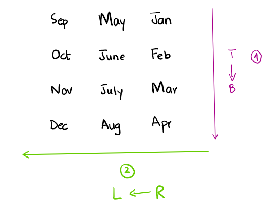

#### by [Yumna Ahmed](/people#yumna-ahmed-25-github)

This summer, I am investigating the effect of timeline orientation with right-to-left language speakers like Urdu, Arabic, Hebrew, and Farsi. Timelines are conventionally written in left-to-right orientation, and little research has been done on the effectiveness of other orientations, *specifically with right-to-left language speakers*. We question whether having timelines in right-to-left orientation for speakers of right-to-left languages results in participants performing better on simple tasks using these timelines. We hope to answer this question in our upcoming article about our study.

To start, we needed to review current literature to analyze how temporal concepts are ordered in these languages. While we conducted our research study in English, Urdu, and Arabic, my focus was primarily on Urdu resources as Urdu is my native language and my preferred language of use at home and school (in Pakistan). 

While completing my primary and secondary education in Pakistan, I was exposed to Urdu literature throughout my life since it is the national language of Pakistan. Interestingly, I do not recall ever seeing a timeline being used in the content I have had exposure to. When this research project was pitched, I found myself thinking deeply about my experiences as I grew up in Pakistan. Having studied in the British CAIE (Cambridge Assessment International Education) system, subjects like history and geography where one may most expect to see timelines were taught in English, while Urdu grammar and literature were taught in Urdu. Islamiyat could be taken in Urdu, but my institution opted for using English.

I studied Urdu and Pakistan Studies (taught in English) as part of my O-Levels (grades 9 through 11). I recall seeing timelines of Pakistan and world history in my *English* history textbooks, or at least summaries of time events before the chapter dove into deeper details of each event. As such, looking into Urdu history textbooks was our first instinct. Did Urdu books use any timelines, now that I was actively on the lookout for them? If so, how did they order the events? Do they choose the conventional left (past) - right (future) order similar (and parallel to) English? Or do the authors write timelines in Urdu that are parallel to Urdu’s right-left read and write direction? 

I found all sorts of resources  - from old scriptures to modern textbooks taught in schools today. Among those, a select few that stood out:
 * *'Mashrati Uloom'* for Grade 5 [link here][fifth-grade-sst]
 * Monthly *'Phool'* Digest September 2014 [link here][flower-mag]
 * *'Mutala-e-Pakistan'* Textbook for Grade 9 [link here][mutala-pak]

It was at the time of sifting through these resources that I had an important realization – **Urdu literature tends to categorize time not in a manner similar to its read-write direction - but *perpendicular***. In these sources, events written in Urdu are listed from top to bottom rather than right to left or left to right. There seemed to be no attempt at summarizing time events in a timeline, as one would perhaps find frequently in English resources. Events were sorted by time from top to bottom, with each event followed by its respective details in paragraph form. For example, see a page from the *'Phool'* digest below: 

*Page 48 from Monthly 'Phool' Digest, September 2014*

Notice how the events are categorized chronologically, with the earliest event found near the top right corner of the page, while the later events follow below, with the latest event near the bottom left corner of the page. The columns are ordered from right to left, but this format conforms to the magazine’s layout where the content is displayed in columns that go right to left. This is not direct evidence of a top-bottom approach - one can simply argue that such is the design of the magazine, hence the ordering. However, it is worth noting that there was no attempt to summarize the events through some tool, such as a timeline.

Meanwhile, similar design and layout choices can be seen in *'Mutala-e-Pakistan'*, as illustrated below:

*Page 29-30 from 'Mutala-e-Pakistan' Textbook*

In the examples above, each date is marked by a star (see right-most side of the pages). While the text isn’t translated, the years are written in English making it easy to observe the dates are progressing from top to bottom from 1909, 1913, 1916, and so on. This is very close to a summarized version of the events; notice how each event does not go into much detail, as seen in the magazine previously. This could be in the interest of keeping content as minimal as possible for studying purposes. 

Later, in the same book, the content focuses on important political leaders/ policies in post-independence Pakistan (starting page 42). Here, each section has a header and the year the event took place, before focusing on more details of the event in subsequent headings. Take for example the section that focuses on General Ayub Khan’s regime: 

*Page 42-45 from 'Mutala-e-Pakistan' Textbook*

While these details are necessary, once again we see no attempt at summarizing the events or using visual tools to aid a better understanding of the progression of time. For example, many textbooks choose to have a pre- or post- chapter summary of the discussed content. In such chapter summaries, one could reasonably expect a table with a summary of events or a visual timeline. 

However, one can argue that such tools and aids are not required at the level the book is designed for (9th grade). Often, visual tools are incorporated more into literature with a younger target audience who may learn better with such aids. Thus, we looked into Urdu resources designed for younger students. 

We found a social studies textbook for 5th graders, *'Mashrati Uloom'*. This book has an entire chapter focused on dates, and this is where we found our strongest evidence of the lack of right-to-left visuals/ tools that would align with our expectations of appropriate uses of timelines. 

Below is the figure from the social studies textbook, which explains the Islamic (lunar) and the Gregorian (solar) calendar. 

*Page 26 from 'Mashrati Uloom'*

Although the calendar months are in Urdu, the numbers are not written in the Urdu numerical system,. Even though the months are in Urdu and the expected readers understand Urdu, we see that the months are arranged top to bottom first, ***then left to right, contrary to the reading direction of Urdu***. I illustrate this arrangement below: 

*Provided calendar design*

This is astonishing - the month names are in Urdu, the book is in Urdu, yet the calendar is arranged from left to right. As a native Urdu speaker myself, this made no sense to me. I would expect to see a top-to-bottom arrangement, then followed by a *right-to-left* arrangement, as I illustrate below:

*Expected calendar design*

Meanwhile, similar to the previous book (*'Mutala-e-Pakistan'* ; textbook for 9th grade), this textbook also lists out important events in Pakistan’s history. Again, (starting page 29) we see a similar pattern of the event name and year in the section heading, then a following paragraph or sentences explaining the details of the event. 

*Page 30-32 from 'Mashrati Uloom'*

Once again, even though this is a 5th-grade textbook, we did not find any attempt at summarizing these time events. The student must flip through multiple pages to see the time range and important events, instead of having it summarized in one place as a visual aid. 

In the later section of the chapter, important events after the independence of Pakistan are summarized in a table in chronological order. This is the closest attempt we found to making a timeline or summarizing information. Interestingly, the way this table is designed is also worth looking into. 

*Page 36 from 'Mashrati Uloom'*

First off, it is categorized in a top-to-bottom orientation again. This makes sense given the amount of content that needs to be written. However, we did not see the need for an index in the rightmost column - it does not necessarily contribute much to the content. 

Meanwhile, since the ordering is by time (chronological), knowing the date of the event isimportant, so I would expect to see it first. . Given the right-to-left direction of the language, listing  the year as the rightmost column would make the most sense, then the event description following it on the left. Having the date/ year at the end (i.e the leftmost column) is actually counterintuitive when reading in a right-to-left way. 

After having looked through a multitude of resources in Arabic, Hebrew, and Urdu, we failed to find any evidence of a right-to-left timeline. In the resources available to us, we did not find any evidence of a timeline either, irrespective of orientation. Due to this limitation and access to a full library of literature in these languages, we are unable to confirm whether timelines exist in these languages or not. 

However, in our search, we found that a top-to-bottom orientation is preferred over a horizontal (right-left / left-right) orientation when communicating events according to time in a textual way. This phenomenon is interesting - choosing an orientation perpendicular to the language’s read-write direction opens the door to many questions. Why is this so? Is it due to limitations in technological infrastructure that prevent designers from designing content according to cultural specifications? Is there some insight as to how language metaphors are used, and would instead support vertical spatial mapping over horizontal ones? We believe there is potential for further findings in this subject which can lead to working for the needs of such previously underserved communities. 

[fifth-grade-sst]:https://www.taleem360.com/5th-class-social-studies-urdu-medium-textbook-by-pctb-in-pdf-format-dzs
[flower-mag]:https://www.google.com/books/edition/Flower_Sep_14/mkteBAAAQBAJ?hl=en&gbpv=1&dq=%D9%BE%D8%A7%DA%A9%D8%B3%D8%AA%D8%A7%D9%86%DB%8C+%D9%81%D9%88%D8%AC+%DA%A9%DB%92+%D8%B3%D8%B1%D8%A8%D8%B1%D8%A7%DB%81+%DA%A9%DB%8C+%D8%AA%D8%A7%D8%B1%DB%8C%D8%AE&pg=PA14&printsec=frontcover
[mutala-pak]:https://archive.org/details/mutaliya-pakistan-text-book-9th-class-punjab-text-book-board-lahore/mode/1up?view=theater

