#### by [Olivia Burls](/people#olivia-burls-28-github)

 Developers use compilers to help run web browsers, like how the V8 compiler powers Google Chrome, so you can see how important a working compiler is. While compilers are incredibly useful, debugging them is extremely difficult and requires parsing through thousands of lines of trace output. Compiler developers look at the graph phases in this trace output (produced by the compiler) and compare them. While tools like Google V8’s Turbolizer or Firefox Spidermonkey’s iongraph help visualize these graphs, they require additional work from the developers. This summer, I began working on this existing research to continue to build a solution. In this work, we created a multi-view visualization tool that allows developers to compare two phases at once and gives them an overview to potentially help spot buggy code faster.

### What Are We Actually Tackling?
In short, compilers translate human code (a JavaScript file) into machine code (code the computer understands) so it can perform the tasks. An ahead-of-time compiler runs before the program executes. JIT compilers, or Just-In-Time compilers, perform optimizations in phases while the program runs. This type of compiler is often seen in web browsers, like Google's V8 engine to power Chrome or Mozilla's SpiderMonkey engine to power Firefox. Compilers produce an Intermediate Representation (IR), a graph of nodes and edges that represents how the compiler converts the high-level language into machine code. In each optimization phase, the compiler produces an IR that improves the efficiency of the code as it gets closer to the machine code. These IR’s are often visualized in a Sea-of-Nodes or Control Flow Graph (CFG) layout, and the compiler can produce multiple optimization phases, so this means we have multiple graphs for a single JavaScript file.

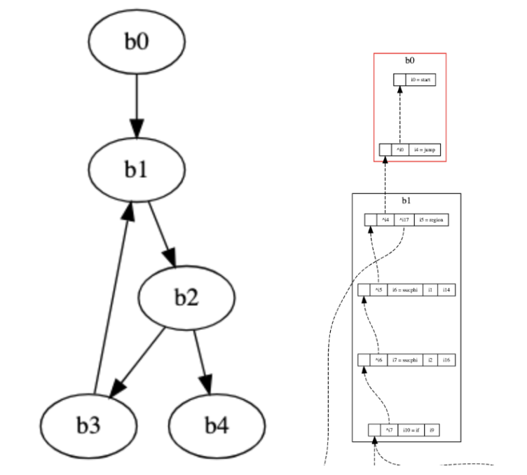

*A Sea-of-Nodes (SoN) graph on the left and a control flow graph (CFG) on the right.*

A single IR phase can be difficult to parse because developers have to comb through thousands of lines of a JSON file, a data structure that holds all relevant optimization information. This is where tools such as Google V8’s Turbolizer and Firefox’s iongraph come into play. They visualize these IR phases in its respective layout (SoN or CFG), providing developers with a tool to examine nodes or blocks that typically hold the bug. Developers usually load a JSON(s) into the tool and split their screen so they can see two consecutive phases side by side to track any node or block changes. Developers split their screen because it allows them to look at how optimization phases change overtime. They also review the raw text that is in a JSON file.

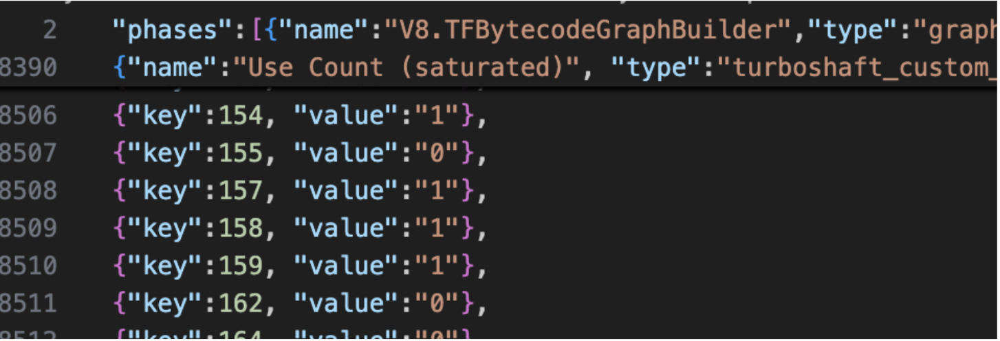

*An example of how long a JSON file could be: this file has over 8,500 lines.*

Current tools do not have support for phase-by-phase or file-by-file comparison, so developers have to pull up the tool twice and splitting their screen to do any kind of comparison. Our goal for the summer was to build a visualization tool that supports the two types of IR graphs (SoN and CFG), shows phase-by-phase comparison, an overview that allows developers to spot potential “buggy” code, streamlining the debugging process for developers.

### Getting Caught Up

Before I could continue any research or even write code, I had to orient myself with the current status of the research. Coming from taking CSC 362 Data Visualization and CSC 250 Computer Organization, I knew vaguely what a compiler was and had some experience in visualizing data into graphs and charts, but there was a learning curve for my first two weeks. Dr. Williams presented me with a poster and poster summary describing the current visualization tool, past papers, and articles detailing a competing tool: [Google V8’s Turbolizer](https://v8.github.io/tools/head/turbolizer/) (and later [Firefox SpiderMonkey’s iongraph](https://github.com/mozilla-spidermonkey/iongraph)). I played around with the tool and spent time understanding the scope of the problem and the compiler data that I was dealing with.  
​

In the beginning stages, Turbolizer was a huge point of reference in the initial development of our tool and understanding SoN and CFG graph layouts. We also noted potential features and gaps in the tool that we would want to implement. We spent a couple of days just trying to get the tool running. I used AI to generate JavaScript files and worked in the terminal to produce an acceptable JavaScript file that was “hot enough” to run and give me a trace output (meaning, the JavaScript code used enough resources that it needed to be heavily optimized with the compiler). I noted the trace output itself, specifically what the layout looked like, what the nodes represented, and eventually mapped some information back to the JSON file to see where everything lived. While I didn’t know this at the time, it was extremely important to understand the JSON structure of the trace data, as I used that knowledge when developing the tool. Along with understanding the data and Turbolizer, V8 has seven other tools. Part of our initial research was to also understand these seven tools and to get an overview of what exists, ensuring our tool was different and tackled new problems.

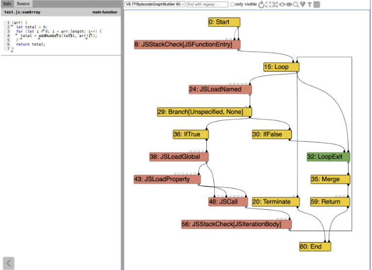

*A view of the Turbolizer tool*

On the visualization side, producing a tool that is human-readable, representative of the data, and visually appealing also influenced how we tackled this problem. I did a miniature literature review that mostly focused on these visualization concepts. I researched graph drawing, incorporating interactivity effectively, and graph comparison. This research affirmed a lot of the initial design ideas we had, like a side-by-side view and linked interactions between each view. It also stressed the idea of preserving the user's mental map of what the graphs look like. This means that when viewing an IR graph from phase to phase, nodes or blocks should not be changing their position drastically. This information would be especially useful when I tackled the layout algorithms for the graphs.

### Designing our Vis Tool

Kwasi and I took some time to sketch out the three different views we wanted and received feedback. These views are the heatmap overview, the dual view, and the small multiples view. Our tool, JITVis, visualizes each IR phase at different levels while adding additional features recommended by Dr. Williams and Dr. Lim. I primarily worked on the dual view that does a phase-by-phase comparison.

#### Heatmap Overview

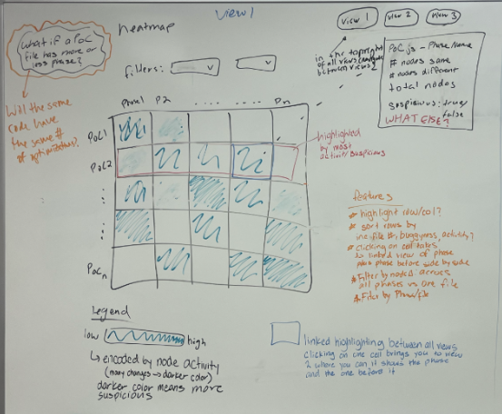

*A sketch of the heatmap overview*

Our initial idea had this view organized into a table of phases (columns) and JSON files (rows) and colors each cell based on how “buggy” the phase could be. In our actual implementation, the coloring is based on how different phases are from each other, which helps show where unusual behavior may be happening.

#### Dual View

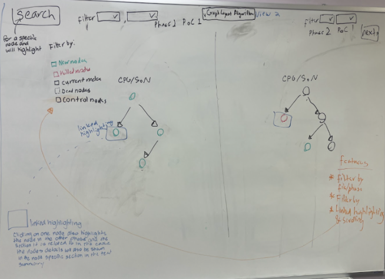

*A sketch of the dual view*

In our sketch, this view allows you to view two phases side by side and gives a phase and node summary. My implementation looks mostly like this, but laying out the different kinds of graphs (SoN and CFG) was much harder than we initially thought.

#### Small Multiples

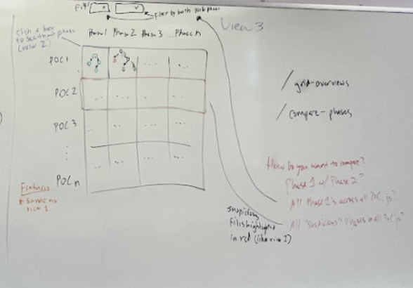

*A sketch of the small multiples view*

This view would show miniature versions of the outlines of each graph so developers can look at structural changes. We are currently working on this view.

### Creating the Dual View

Before I began coding the dual view, I researched some layouts specifically for the SoN style, as that was the first graph I tackled. I ended up using a Sugiyama style, which was a decent layout to start with, but quickly became unreadable as the SoN graphs grew larger. Nodes were clustered together or layered on top of each other. These graphs also have a lot of edges, so those were chaotic as well. Once I got a stable graph rendered, I added certain features that were recommended from my talks with Dr. Williams and Dr. Lim, and my notes on the Turbolizer. This included things like a search feature, color-coding the nodes, adding the relevant source code, summarizing the entire phase, and adding information about the nodes upon clicking. With that, the first iteration of this view was done!

​
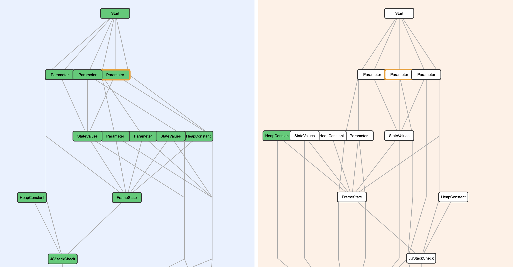

*My first take at SoN graphs. Even though this graph is relatively small, there are already some overlapping nodes and following the edges is tricky.*

​
The next big step was implementing the CFG graphs. This is where I really began to research CFG implementation, specifically Spidermonkey’s iongraph. I looked at an [article](https://spidermonkey.dev/blog/2025/10/28/iongraph-web.html) that explained how the layout worked and gave some pseudocode, as well as their GitHub repository containing all the open-source code. Here, I used Claude to help me make sense of the algorithm and implement this specifically in JavaScript because it was written in a different language. I had to change how the data was loaded in because Spidermonkey’s JSON is structurally different from the one I had been using. My biggest problem with this was rendering the edges. There were some floating edges and others that were disconnected. While it did take a day and a half to debug with my professor, the fix was actually pretty simple: I had an issue with actually drawing the edges as opposed to the algorithm not working.
​

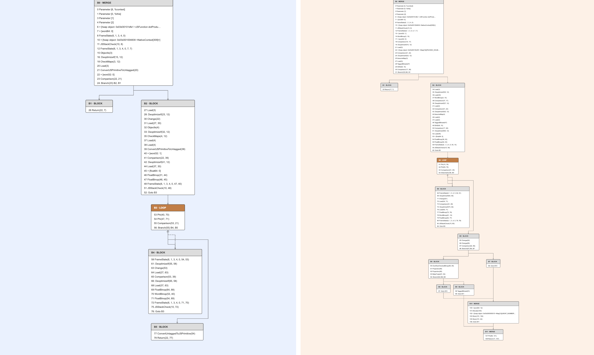

*The CFG layout. This layout looks much cleaner because it's a different type of graph than the SoN graphs (and the [layout algorithm](https://spidermonkey.dev/blog/2025/10/28/iongraph-web.html) was designed to mirror how developers think about their code).*

​
I went back to the SoN phases and refined the layout. I ended up deciding to use a different style. I still used a Sugiyama layout, but I added color and shape to the nodes and edges. This new style is based heavily on a tool called [Seafoam](https://chrisseaton.com/truffleruby/basic-graal-graphs/#:~:text=There%20is%20a%20graph%20of,nodes%20graphical%20IR%20to%20C2), which displays GraalVM's Sea-of-Nodes graphs in an understandable and visually appealing way. It also shortened the edges so there was “less traffic”. Immediately, the first try was better than the old layout, but I still ran into issues such as a missing node and edges for my test case. After more debugging and careful tracing of the JSON data, I figured out that a specific type of node and some mismatched labeling were mainly the cause of the missing node and edges.

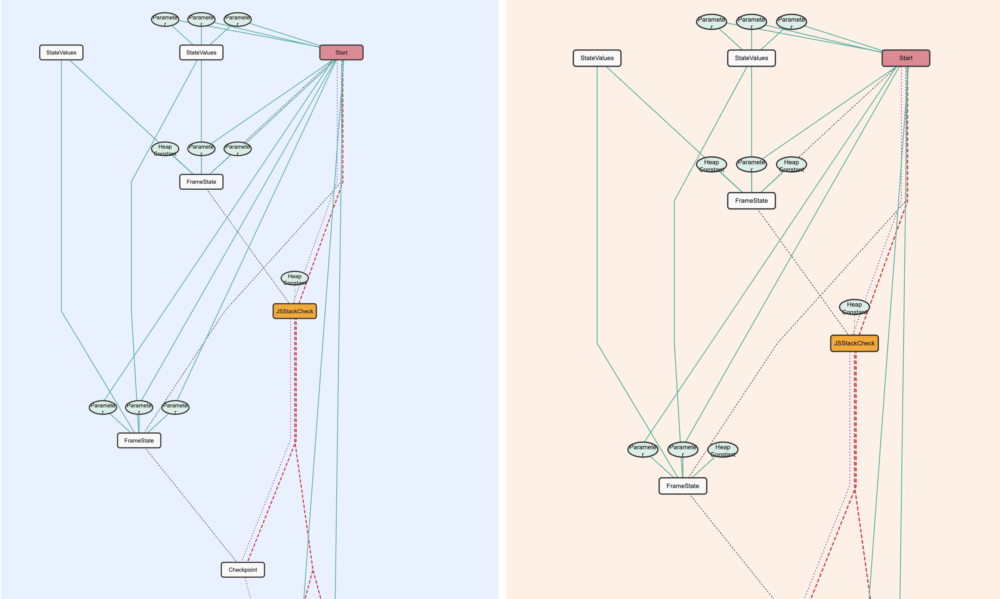
*The SoN layout, with the new coloring and shapes based on [Seafoam](https://chrisseaton.com/truffleruby/basic-graal-graphs/#:~:text=There%20is%20a%20graph%20of,nodes%20graphical%20IR%20to%20C2).*

### Slight Pause -> Poster and Poster Summary

In the midst of designing the prototype, we all worked on creating a poster and a complementary poster summary to be submitted to IEEE Vis, which is a Data Visualization conference. It was really valuable to pause coding and summarize all the information we had been working on. This taught me how to explain the project and gave me practice writing in a professional sense. Through this, we gained extremely valuable insight during a revising meeting with Dr. Lim and his student researcher. They used our tool based on a buggy and a non-buggy test file they gave us. They used the tool exactly as it was intended and more! The new information they took away from the heatmap view affirmed our in-progress visualization decisions. 

### Final Design!

Our final design includes two distinct views, with a third in-progress. The heatmap is colored by the number of node and edge changes from phase to phase, aiming to show which phases could hold “buggy” behavior. Our third view from the design process (small multiples) is currently being worked into the heatmap overview. The dual view contains a phase-by-phase comparison and supports both CFG and SoN graph phases. There is linked highlighting between both views, phase and node summaries, and filtering based on edge or node type.

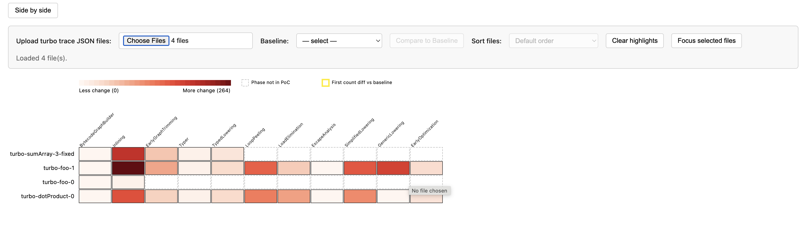
*The heatmap view*

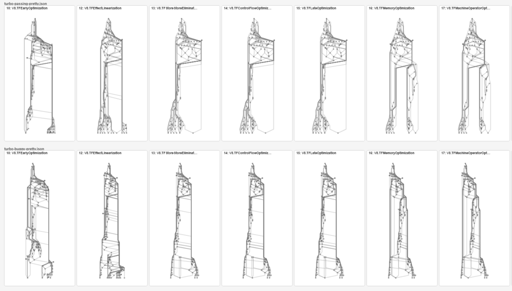
*A sneek-peek into the minigraphs*

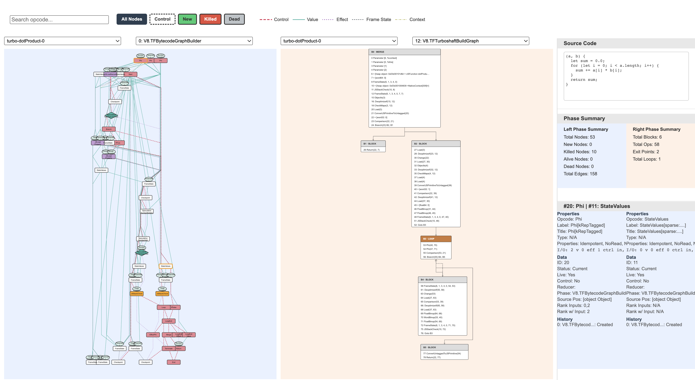
*The dual view*

### Reflection

This was genuinely a really enjoyable summer. I loved the slower pace compared to the school year and devoting all my attention to one project. It was definitely overwhelming at first, having to read multiple academic papers, articles, and some code, and truthfully, I didn’t get some concepts until halfway through the project. But, it was really rewarding to learn all of this information and extend some information from previous classes. I think some of my favorite moments were actually just playing with the tool. I also liked changing the colors and could have fun with that before a more acceptable coloring style needed to be implemented.
​

The hardest part for me was definitely figuring out all of the algorithm and layout work for the graphs. It seemed a lot easier than it actually was. You would think the layout looks pretty good, but after trying on a more complex test file, the layout would look more of a mess. I spent a lot of my later days researching layouts, looking at GitHub repositories, and fighting with AI to make sense of some terms, pseudocode, and code written in a language other than the one I was using. Through this, I did gain a deep understanding of the layouts used and where to pinpoint potential problems in the code. It was constant problem-solving, but extremely satisfying when even the smallest change in the code made noticeable layout differences.
​

I am really grateful to Dr. Williams for trusting me with working on this project and for all her support, expertise, and encouragement this summer. I also really enjoyed my time talking with Dr. Lim, his student researcher, Robby, and Kwasi, as their inputs aided so much in my knowledge and visualization development.
​

I am really proud of all the work I was able to accomplish, and I can't wait to see the newest updates with this tool!

