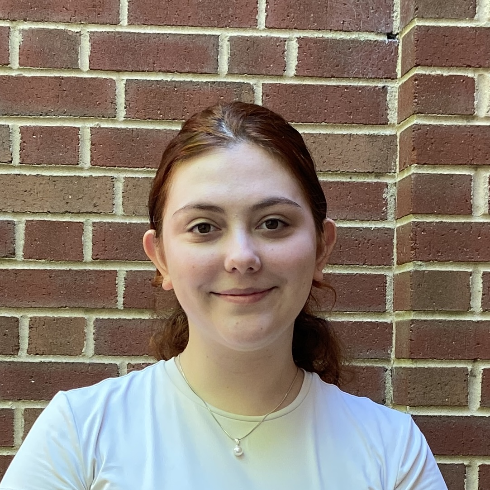
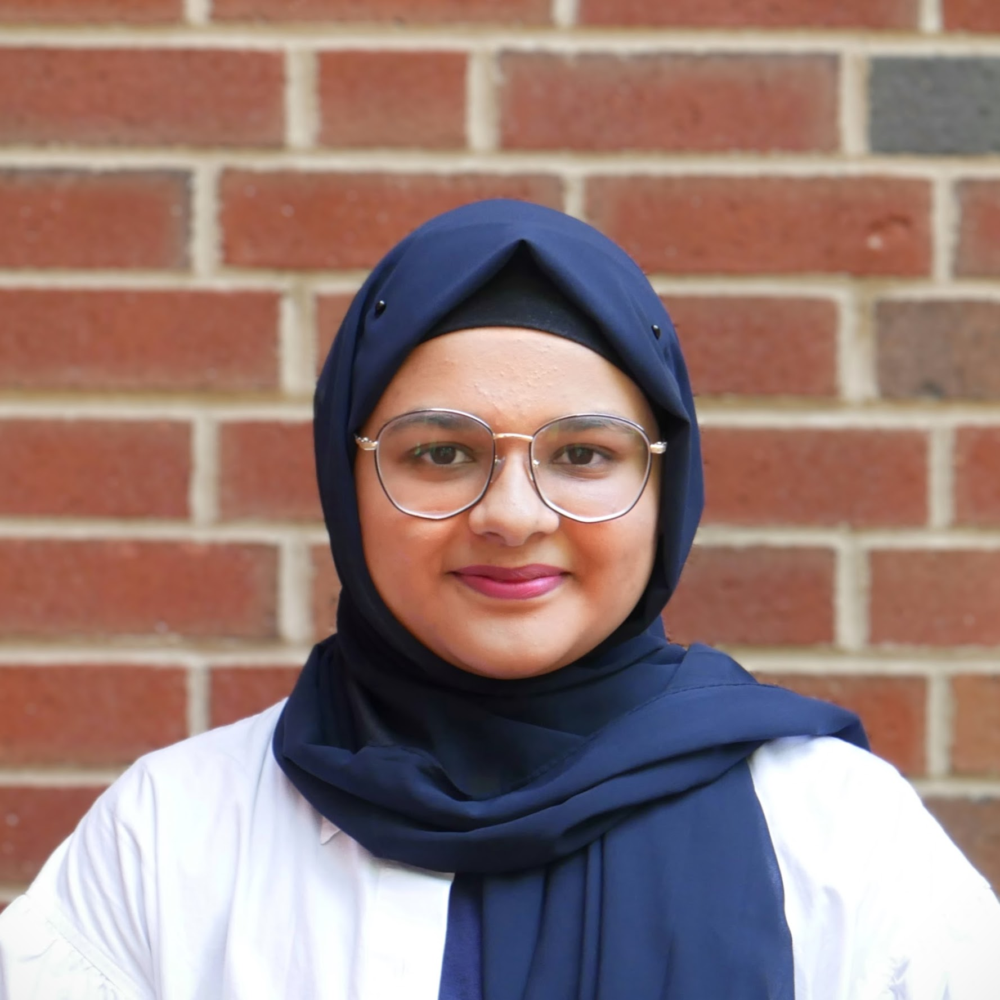
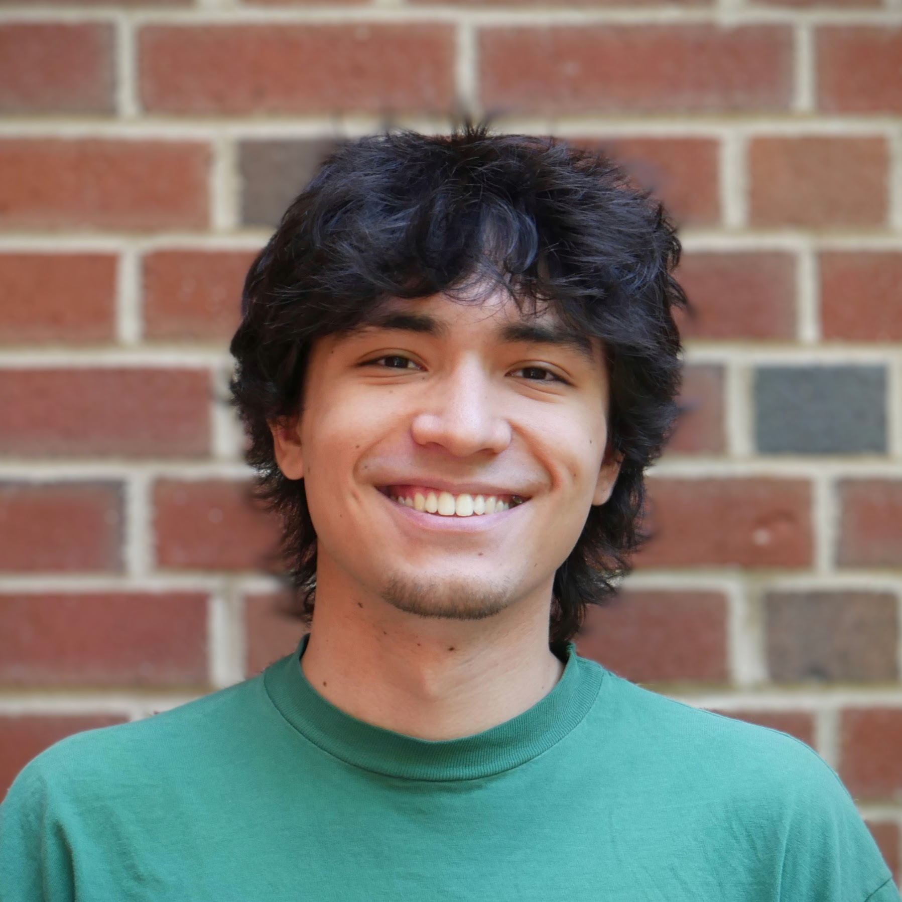
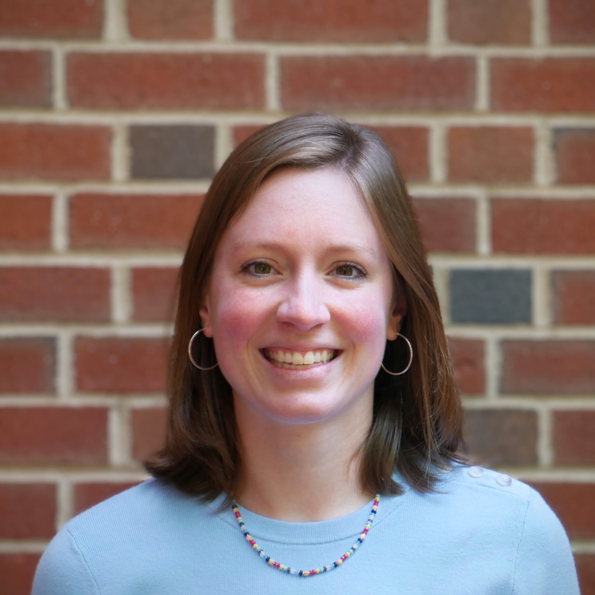

The Davidson Data Vis Lab group member for 2025 is [Yurdanur Yolcu](/people#yurdanur-yolcu-28-github) and [Dr. Katy Williams](/people#dr-katy-williams-17-personal-site).

Previous lab members:
* 2024: [Yumna Ahmed](/people#yumna-ahmed-25-github), [Katherine Hu](/people#katherine-hu-25-personal-site), [David Yoder](/people#david-yoder-26-personal-site).

## Yurdanur Yolcu ('28) ([GitHub](https://github.com/heyitsyurda/))

 [heyitsyurda](https://github.com/heyitsyurda/)

{:.small-image}  

Hi, I'm Yurda! I'm an international student from Ankara, Turkey, and a rising sophomore at Davidson College in North Carolina, USA. I originally planned to major in Economics, but during my first year, I discovered a passion for Computer Science—something I hadn’t encountered much in my traditional, pen-and-paper high school education. Now, I'm excited to pursue a double major in Economics and Computer Science. I'm especially interested in exploring how I can combine these fields to solve real-world problems and create a positive impact.
I'm currently working in the Data Visualization Lab with Dr. Williams, where I've gained valuable experience in data visualization, front-end development, and human-centered design. This opportunity has deepened my curiosity and made me even more excited about the possibilities ahead. I know I'm still at the beginning of a long journey, and I'm looking forward to seeing how my path in computer science will unfold.

## Yumna Ahmed ('25) ([GitHub](https://github.com/yuahmed))

 [yuahmed](https://github.com/yuahmed)

{:.small-image}  

I am Yumna F. Ahmed, and for me home is in Karachi, Pakistan. I am a rising senior at Davidson College, NC, USA. I found Davidson College as part of my search for Liberal Art institutions. Even though it had not been among my top 3 choices, I find myself very happy to be here!

I study Computer Science & Digital and Screen Media Studies double major. Some classes I enjoyed at Davidson are Database Systems, Critical Web Design, Software Design and Data Visualization. All these cater to some skill building relevant to full stack development, which is my career focus. As part of the final projects for these classes, I built websites with a functional backend that can be found on my GitHub profile. 

Meanwhile , I also have research experience working in machine learning  with ALPhA (2023), and in info vis with the Data Vis Lab (2024; in progress). Personally, I enjoy working in interdisciplinary fields, such as human computer interaction - for example, I enjoy questions such as “How do communities around the globe interact with technology? How have such interactions shaped their society?” So far, I have thoroughly enjoyed my projects and learnt valuable skills, which I am now considering to further improve by pursuing graduate studies. 

## Katherine Hu ('25) ([Personal Site](https://www.yangkatherinehu.com/))

  [KatherineHu-2025](https://github.com/KatherineHu-2025)

  

Hi, I’m Katherine! I’m an international student from Shanghai, China, majoring in Computer Science with a minor in Mathematics. Initially, I planned to study Biology during my freshman year, but I discovered a strong passion for Computer Science while taking Data Structures. This led me to declare Computer Science as my major.
During my sophomore year, I worked as an embedded tutor for CSC121: Programming and Problem Solving, and for one semester, I tutored CSC321: Analysis of Algorithms. These experiences enhanced my problem-solving and debugging skills. In the summer of my sophomore year, I conducted research on concurrent data structures with Dr. Mendes, and I am currently working in the Data Visualization Lab with Dr. Williams. I view Computer Science as a versatile toolbox that intersects with all my areas of interest, enabling me to create fascinating tools across various fields. I am particularly captivated by practical applications, as I can observe tangible improvements at every step. Previously, I have built machine learning models to recognize American Sign Language letters and developed a classical music concert database with a front-end website.
In my spare time, I enjoy attending musicals and have been taking singing classes since my sophomore year. I also love traveling, as it allows me to learn about different cultures, meet new people, and taste local cuisine.

## David Yoder ('26) ([Personal Site](https://yoder.ing))

  [yodering](https://github.com/yodering)

 

 I’m a Computer Science major at Davidson College, with a strong interest in the intersection of computer science and creative visuals. I found my love for computers at an early age, and I’ve been editing videos as a hobby since 2016. Because of these two interests, I sought to find a way to put code and the creative aspect of video editing together. This led me to web design and graphics programming. At Davidson, I had the pleasure of taking Professor Mundy’s Critical Web Design class which solidified my interests and widened my scope of the creative coding world. Since his class, I’ve created several web applications, such as Graphify, a Spotify playlist generator, and an audio visualizer. I had the opportunity to work with Professor Mundy and create a clone of  Patatap, and I’ve also created my own website. My drive in the Computer Science space is to remain creative and contribute to the making of something visual.

In addition to creative coding, I am a big fan of the Rubik’s Cube and average just under 10 seconds in solve time. I’ve competed numerous times in competitions and have attended several national-level competitions and even the World Championships in 2023. I’ve been competing since 2016 and continue to practice daily.

Concord, NC is home. I’ve lived here all my life. My parents attended Davidson, and I grew up visiting the campus and attending reunions. I never intended to go to Davidson; I knew I “wanted” to, but that was only because my parents went. However, when applying to schools, I reflected upon my brief times at Davidson, and considered how I would feel about calling it “home.” Now, approaching my Junior year, I couldn’t see myself anywhere else.

## Dr. Katy Williams ('17) ([Personal Site](https://kawilliams.github.io/))

 [kawilliams](https://github.com/kawilliams)

 

I’m an Assistant Professor of Computer Science at Davidson College. I received my Ph.D. in Computer Science from the University of Arizona in May 2023. I previously worked in the HDC lab with Kate Isaacs and Alex Bigelow. My research is in data visualization, a creative side of computer science where I can learn about interesting datasets while also building beautiful charts and graphs to aid understanding of the data. As part of my research, I have built visualizations for technical, high-performance computing data and have also published work on people’s sketches of data and how they think about a dataset. My research involves thinking about how people think about data. I like questions such as “What if instead of imagining your data as abstraction X, you tried abstraction Y?” and “In your opinion, what is the most interesting part of the data?”

I strive to make computer science an inclusive, welcoming environment by mentoring women+ in CS, hosting department-wide social events, and leading the Student Volunteers at the IEEE VIS Conference.

Before attending the University of Arizona in the August 2017, I graduated from Davidson College in North Carolina with a B.S. in Computer Science and a Math minor. I was a Division I swimmer in college and swam at the 2016 Olympic Trials in the 100m and 200m breaststrokes.